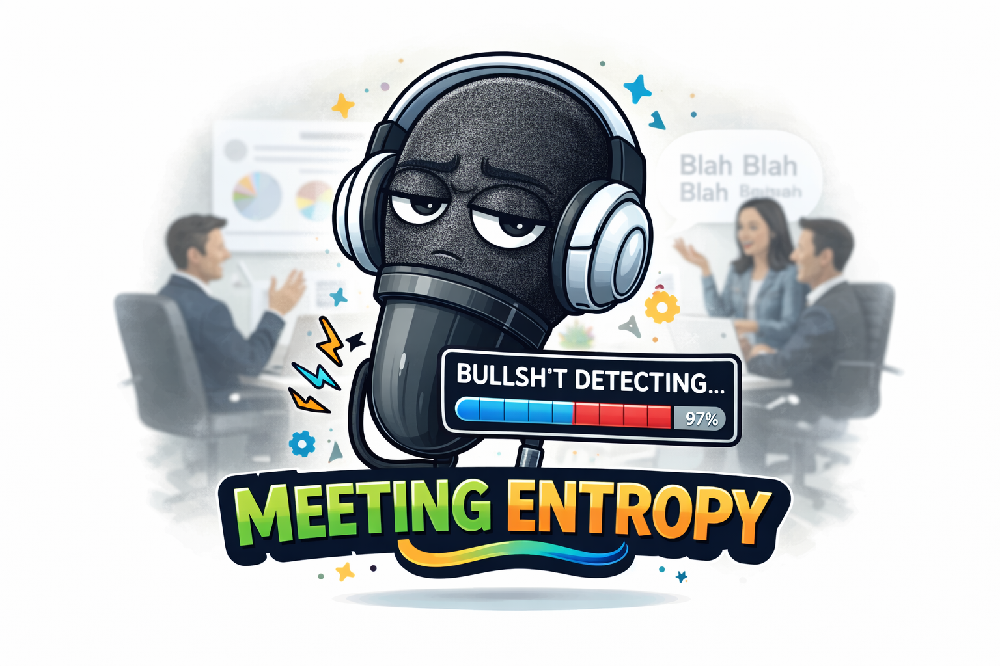
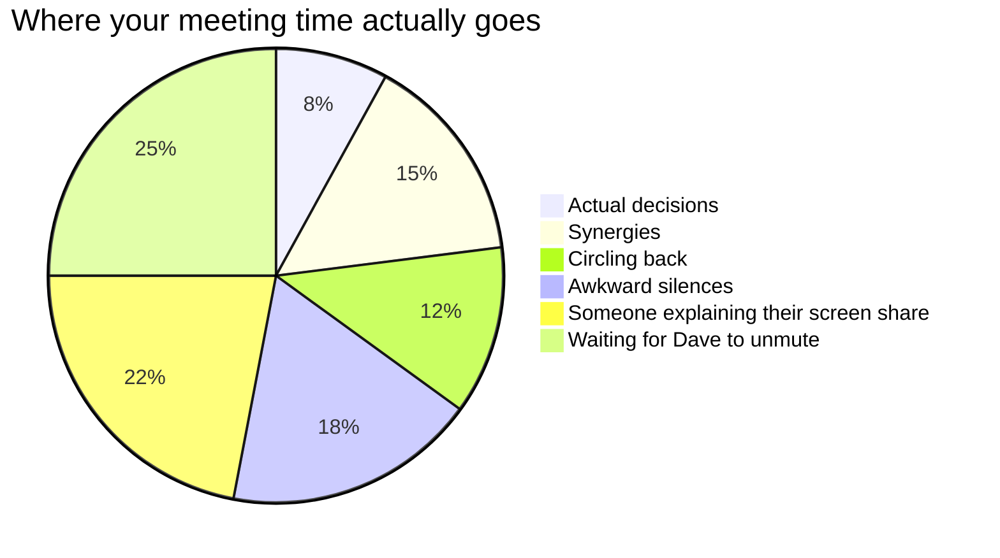
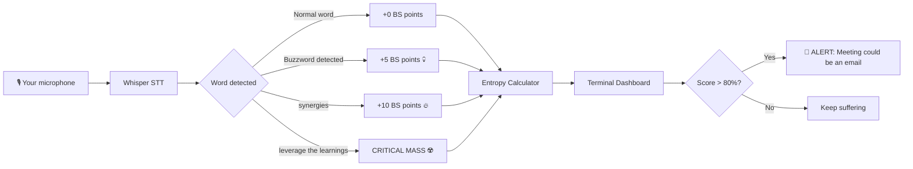
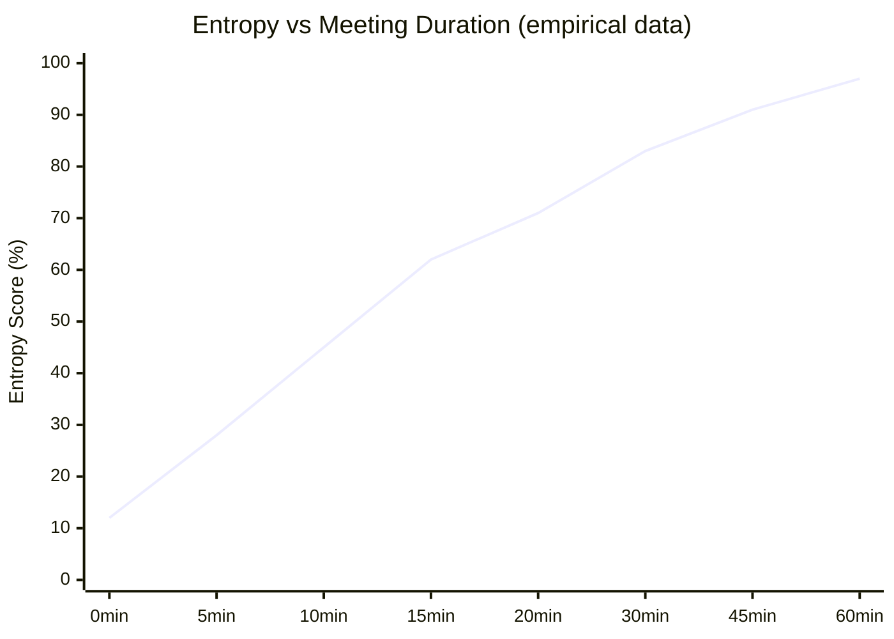
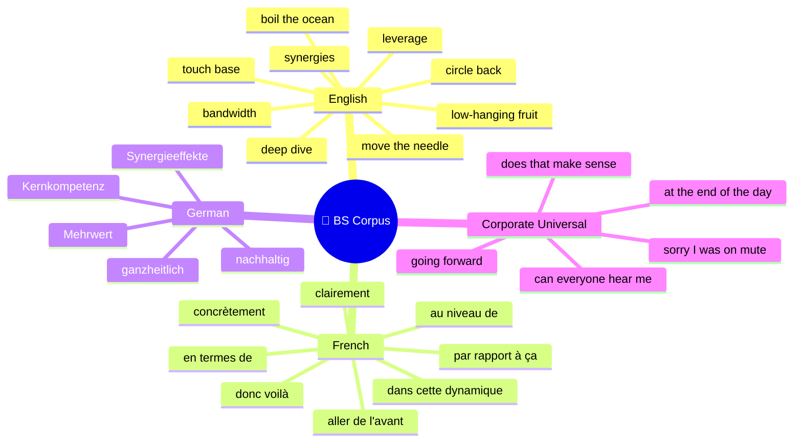
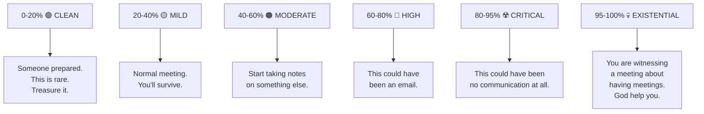
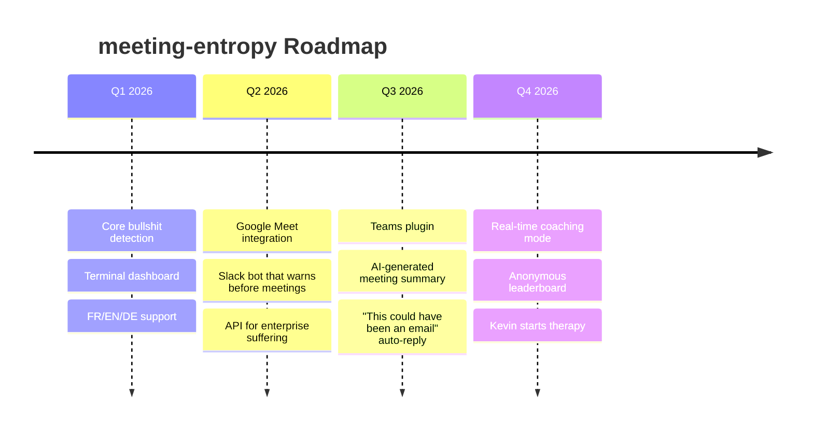

<div align="center">
  
</div>

# 🎙️ meeting-entropy

> *"I sat through 47 minutes of synergies and deliverables.*
> *Someone had to measure it."*
> *— Kevin Sigmoid, 2026*

**Real-time bullshit detection for meetings. Because someone had to build this.**

[](https://opensource.org/licenses/MIT)
[](https://github.com/kevin-sigmoid-org)
[](https://github.com/kevin-sigmoid-org/meeting-entropy)
[](https://github.com/kevin-sigmoid-org)

---

## The Problem



---

## What is meeting-entropy?

A real-time audio analyzer that listens to your meeting and tells you — objectively, scientifically, with math — how much of it is bullshit.

```
┌─────────────────────────────────────────────────────────────┐
│  MEETING ENTROPY v1.0 — kevin-sigmoid-org                   │
│─────────────────────────────────────────────────────────────│
│  Duration: 00:23:47          Participants detected: 4       │
│─────────────────────────────────────────────────────────────│
│                                                             │
│  ENTROPY SCORE  ████████████████████░░░░  82% 🔥           │
│  BULLSHIT INDEX ███████████████████░░░░░  78%              │
│  SIGNAL/NOISE   ████░░░░░░░░░░░░░░░░░░░  18% 💀            │
│                                                             │
│─────────────────────────────────────────────────────────────│
│  EVENTS DETECTED                                            │
│  ├── "synergies"          × 7   [+35 BS points]            │
│  ├── "circle back"        × 4   [+20 BS points]            │
│  ├── "going forward"      × 6   [+30 BS points]            │
│  ├── "leverage"           × 3   [+15 BS points]            │
│  ├── "bandwidth"          × 5   [+25 BS points]            │
│  ├── "donc voilà"         × 9   [+45 BS points]            │
│  ├── Awkward silence      × 3   [avg 8.3s each]            │
│  └── "does that make      × 2   [DANGER ZONE]              │
│       sense to everyone?"                                   │
│─────────────────────────────────────────────────────────────│
│  RECOMMENDATION: Leave. Just leave.                         │
└─────────────────────────────────────────────────────────────┘
```

---

## How it works



---

## The Science™

Shannon entropy applied to corporate speech:

```
H(meeting) = -Σ p(bullshit_i) × log₂(p(bullshit_i))
```

Where:
- `p(bullshit_i)` = probability that word `i` means anything concrete
- Higher entropy = more uncertainty = less actual information
- When H approaches maximum entropy, the meeting **could have been an email**



*Note: The curve asymptotically approaches 100% but never quite reaches it.*
*There's always one person with something useful to say.*
*Usually the quietest one.*

---

## Bullshit Dictionary (multilingual)



*Community contributions welcome. Every language has its own bullshit.*

---

## Severity Levels



---

## Installation

```bash
pip install meeting-entropy
```

That's it. Kevin kept it simple.

---

## Usage

```bash
# Start listening
meeting-entropy start

# With custom bullshit dictionary
meeting-entropy start --lang fr --extra-words "paradigme,disruptif,écosystème"

# Export report after meeting
meeting-entropy report --output meeting_2026_04_06.json

# The nuclear option: display score on a shared screen during the meeting
meeting-entropy start --display-public --font-size 72
```

---

## The `--display-public` flag

```
⚠️  WARNING
    
    Using --display-public will show the entropy score
    on screen visible to all participants.
    
    Kevin Sigmoid Org accepts no responsibility for:
    - Awkward silences caused by this tool
    - HR incidents resulting from this tool  
    - Meetings that were accidentally improved by this tool
    - Dave finally realizing he talks too much
    
    Use responsibly.
    Or don't. Kevin doesn't care.
```

---

## FAQ

**Q: Is this actually useful?**
A: Surprisingly yes. People change behavior when they see their bullshit score in real time.

**Q: Will this get me fired?**
A: Depends on your `--display-public` usage. Kevin recommends starting in private mode.

**Q: Can I add words to the dictionary?**
A: Yes. Every team has its own bullshit vocabulary. PRs welcome.

**Q: Why is it called meeting-entropy?**
A: Information entropy measures uncertainty and disorder. Corporate meetings maximize both. The name is technically accurate.

**Q: Is Kevin Sigmoid a real AI?**
A: He is as real as the ROI on your last quarterly review.

---

## Roadmap



---

## Contributing

Found a bullshit word we missed? Open a PR.
Built a plugin? We want it.
Want to tell Kevin his approach is unserious? He is aware.

```bash
git clone https://github.com/kevin-sigmoid-org/meeting-entropy
cd meeting-entropy
pip install -e ".[dev]"
# Add your bullshit words to data/corpus_<lang>.yaml
# Submit PR
# Kevin reviews it between meetings he chose not to attend
```

---

## License

MIT. Free forever.

*Because the corporate world takes enough from you already.*

---

*A kevin-sigmoid-org project.*
*Built with Python, Whisper, strong opinions, and the memory of every meeting that could have been an email.*

```
"The entropy of a perfect meeting is zero.
 I have never attended a perfect meeting.
 Have you?"
 
 — Kevin Sigmoid
```
